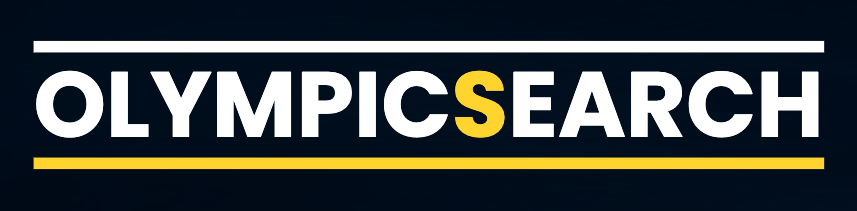
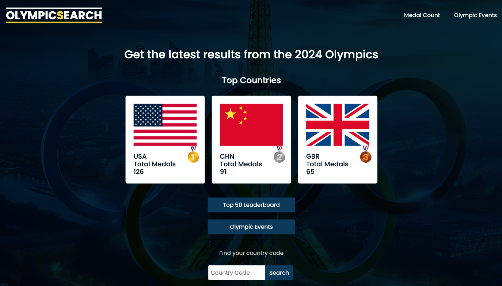

<a name="readme-top"></a>

<!-- PROJECT LOGO -->
<div align="center">
  <br>
  <h1 align="center">HTML + CSS + JavaScript <br>(Client-Side & Server-Side)<br> Node.js Introduction</h1>
  <h4>Practice using JavaScript on the server-side with Node.js and handling data from API's by contributing a new feature to a small project</h4>
</div>

<div align="center">
  <h2>
    <a href="#feature-roadmap" target="_blank" rel="noreferrer noopener">Get Started</a>
  </h2>
  
  <h1 align="center">OlympicSearch</h1>
</div>

<!-- SCREENSHOT -->

<div align="center">
  
  <h2 align="center"></h2>
</div>

<div align="center">

### Hosted On

[](https://docs.netlify.com/get-started/)

<h3>
    <a href="https://olympicsearch.netlify.app/" target="_blank" rel="noreferrer noopener">View Project Live</a>
</h3>
</div>

## Built With

### Front End

[](https://html.com/html5/) [](https://www.w3schools.com/css/default.asp) [](https://ecma-international.org/publications-and-standards/standards/ecma-262/)

### Back End

[](https://nodejs.org/en)

## Project Features

### Core Functionalities

- [x] Display 2024 Olympics top 3 Countries
- [x] Search Medal Count (by Country Code)

### Feature Roadmap

- [ ] Add Page Layouts
  - [ ] Home Page - General Information
  - [ ] 2024 Olympics Results Page (By Event)
  - [ ] Medal Count Leaderboard
    - [ ] Countries (Top 50)
- [ ] Redesign Webpage (Cross-Browser Compatibility)
  - [ ] Change Font/Logo
  - [ ] Add Light/Dark Theme
- [ ] Switch from Codante to Wikipedia API (mwn bot framework)
- [ ] Refactor to MVC Architecture
- [ ] Build OlympicSearch API
  - [ ] Save Olympics data to DB
  - [ ] Add Historical Olympics Search Page
  - [ ] Add Caching (Lazy Loading)
- [ ] Deploy to Render

<!-- CONCEPTS & GETTING STARTED -->

## Getting Started

You can [make a contribution](#contributions) and build the next available feature on the roadmap or request a new feature [here](https://github.com/RjayBrown/olympics-search/issues/new). Any contributions you make are appreciated! You can also [fork the repo locally](https://github.com/RjayBrown/olympics-search#fork--run-locally) to use as a template for your own project. Making significant design or functional changes can be a great way to learn and get hands-on practice. Start with the node-intro.js file to review the core concepts below.

### Core Concepts

- Server-Side JavaScript with Node.js
- Asynchronous Programming
- Building API's (URL Endpoints & Serving Files)
- Public API's (Using Fetch & Handling JSON Data)

Working on this project helped me understand what servers are and how API's work. I learned how to create a server using the native node modules, and configure the API to respond with files that allow the website to be seen in the browser. Getting the data to display correctly when the page loads was a challenge, but going through that frustration definitely helped solidify my general knowledge of how JavaScript is used with the event loop to handle asynchronous operations in the browser and the server.

If you run into trouble, you can click any of the badges above to reference documentation or reach out in the [[🕒 catchup-crew]](https://discord.com/channels/735923219315425401/932892279637700658) or [[❓code-help]](https://discord.com/channels/735923219315425401/735925942559440997) channels in the #100Devs Discord. It's an amazing community space filled with supportive developers happy to answer any questions you may have!

## Fork & Run Locally

**1.** To get started, open this [link](https://github.com/RjayBrown/olympics-search/fork) in a new tab to fork this repository

- _**NOTE:** You may find it easier to keep the same name, but you can change it if you like!_

**2.** Click the code button to open the dropdown and copy the URL **(make sure HTTPS is selected)**.

**3.** Open the terminal in your editor, type 'git clone' and paste the URL **(the command should follow one of the formats below)**.

```
 git clone https://github.com/YOUR-GITHUB-USERNAME/olympics-search
```

```
 git clone https://github.com/YOUR-GITHUB-USERNAME/YOUR-REPOSITORY-NAME
```

**4.** Run the command **(Press Enter)**

**5.** Navigate to the project folder

```
cd olympics-search
```

```
cd YOUR-REPOSITORY-NAME
```

**Done!** You are now able to make changes or completely rebuild the project. Happy coding!

<p align="right">[<a href="#readme-top">back to top</a>]</p>

<!-- CONTRIBUTING -->

## Contributions

Contributions are ultimately what makes the open source community such an amazing place to learn, inspire, and create. My goal for this project is to provide a useful resource for people to get hands-on coding practice and learn by doing!!! If you want to build a feature from the roadmap or have any ideas for a new feature, you can clone the repository **_(see step 1 below)_** and create a pull request. If you find a bug, you can open an issue [here](https://github.com/RjayBrown/olympics-search/issues/new). Thank you for contributing to the project!

### First Time Contributior?

**1.** To get started, open your editor and run the command below in the terminal to clone the project locally

```
git clone https://github.com/RjayBrown/olympics-search
```

**2.** Type this command in the terminal to create a branch for your new feature

```
git checkout -b feature/new-feature
```

**3.** Build the new feature!

**4.** Add and commit your changes

```
git add .

git commit -m 'Adding a new feature'
```

**5.** Push your changes

```
git push origin feature/new-feature
```

**6.** Open the main repository in a new tab: [Open Repo](https://github.com/RjayBrown/olympics-search)

**7.** Click the main drop-down and choose your created branch

**8.** Click Compare & pull request

**9.** Click the base branch dropdown and select the main branch

**10.** Click the compare branch dropdown and select your branch

**11.** Type a title and description for your pull request

**12.** Click Create Pull Request

**Congratulations!** Now you wait for your completed feature to be merged and added to the main branch. Once it's merged, you have officially made your first contribution!!!

<p align="right">[<a href="#readme-top">back to top</a>]</p>

<!-- ACKNOWLEDGEMENTS -->

## Acknowledgments

A big thanks to [#100Devs](https://discord.com/channels/735923219315425401/735925942559440997) for the community support, [Roland Vasarhelyi](https://github.com/rolivasarhelyi) for helping build this project and [Leon Noel](https://github.com/leonnoel) for the project inspiration.

If you found some value here and would like to support, feel free to give the project a ⭐️!

### Additional Resources & Mini-Projects

- [HTML/CSS - Semantic Elements & Basic CSS Styles](https://github.com/RjayBrown/html-css-introduction)
- [HTML/CSS - Containers & Responsive Design](https://github.com/RjayBrown/html-css-responsive-design)
- [HTML/CSS - Forms & More CSS Styles](https://github.com/RjayBrown/html-css-forms-and-links)
- [JavaScript (Client-side) - The DOM(Introduction): User Interaction & Changing the DOM](https://github.com/RjayBrown/javascript-dom-intro)
- [JavaScript (Client-side) - Fetch API(Introduction): Promise Chains & Handling JSON](https://github.com/RjayBrown/javascript-fetch-json-data)
- [JavaScript (Client-side) - Fetch API(Advanced): Async/Await & Handling JSON](https://github.com/RjayBrown/war-the-card-game)
- [JavaScript (Server-side) - URL Endpoints with NodeJS(Introduction)](https://github.com/RjayBrown/olympics-search)
- [JavaScript (Full-Stack) - MVC Architecture(Introduction)](https://github.com/RjayBrown/hello-world)
- [JavaScript (Full-Stack) - MVC Architecture(Advanced): Authentication](https://github.com/RjayBrown/freelancr) - Coming Soon!
- [JavaScript (Full-Stack) - MVC Architecture(Advanced): PostgreSQL](https://github.com/RjayBrown/b-u-b) - Coming Soon!
- [JavaScript (Full-Stack) - MVC Architecture(Advanced): ReactJS](https://github.com/RjayBrown/) - Coming Soon!
<!-- LICENSE -->

## License

This project is distributed under the MIT License. [Click here for more information](LICENSE).

<p align="right">[<a href="#readme-top">back to top</a>]</p>
